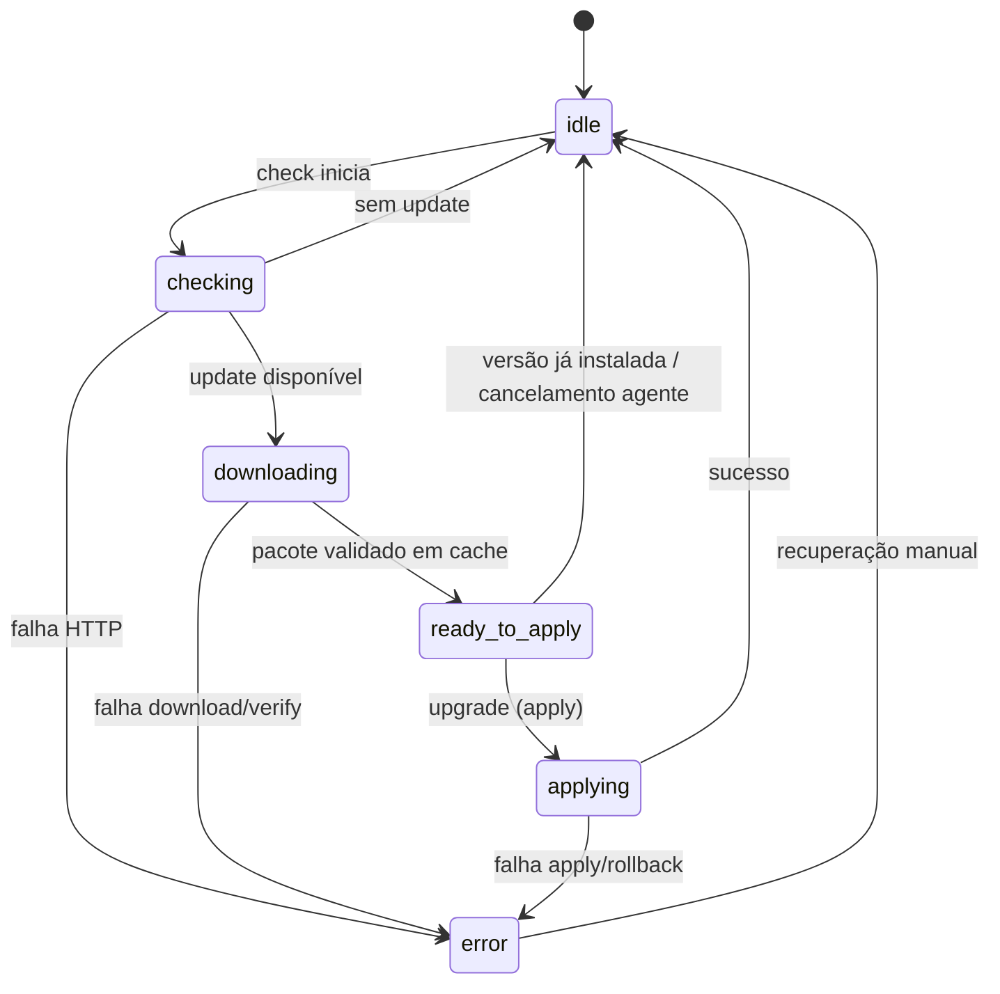

# ADR 0002 — Separação check/download vs apply e fase `ready_to_apply` (grace period kiosk)

**Status:** aceito  
**Data:** 2026-06-25

## Contexto

O [ADR 0001](0001-ota-update-status-json-e-comando-upgrade.md) definiu `ota_update_status.json`, o comando `upgrade` como orquestração completa (`check` → download → `apply` → restart) e o timer systemd a invocar `upgrade`. Isso funciona para actualização manual imediata nas definições, mas não permite ao operador **antecipar** o impacto no quiosque: o download e o apply ocorrem no mesmo fluxo, sem janela de aviso global.

Foi realizada sessão **grill** (2026-06-25) para fechar o desenho de **grace period** no kiosk: o agente descarrega e valida o pacote durante o `check` automático; o kiosk mostra overlay com contagem regressiva antes do `apply`; o operador pode adiar (snooze) até a próxima janela OTA.

Este ADR **emenda** o ADR 0001 nas secções de semântica de `check`, `upgrade`, fases JSON e timer systemd. Mantém inalterados: caminho do ficheiro, writes atómicos, `checked_at_ms`, migração `last_check_at_ms`, semântica de `--force` e fronteira «download só no agente».

## Decisão

### 1. Comandos CLI — responsabilidades separadas

| Comando | Comportamento |
|---------|---------------|
| `check` | Verificação HTTP; se houver versão nova elegível → **download + verificação** do pacote (hash, assinatura); actualiza JSON até `ready_to_apply` ou `idle`/`error` |
| `upgrade` | **Apenas apply** do pacote já em cache local; **sem** novo download nem nova verificação HTTP; restart do kiosk ao concluir |

- O cache de pacote validado é o mesmo directório usado hoje pelo fluxo `apply` (staging em `state_directory` / layout documentado em [[PLANO_OTA_EXECUCAO_PI]]).
- `upgrade` falha com exit ≠ 0 e `phase=error` se não existir pacote em cache pronto para a versão esperada.
- `check` com update já em cache e versão coincidente pode transitar directamente para `ready_to_apply` sem re-download (idempotente).

### 2. Timer systemd

| Aspecto | Valor |
|---------|-------|
| Unidade | `jukebox_ota_agent.timer` → `jukebox_ota_agent.service` |
| `ExecStart` | `jukebox-ota-agent **check** --config /etc/jukeeo/ota-agent.json` (não `upgrade`) |
| Política | Respeita intervalo, janela horária e `ota_check_enabled` em `machine_config` (salvo `--force`) |

O **apply** automático após grace period é responsabilidade do **kiosk** (invoca `upgrade` via `systemd-run` quando a contagem chega a `0:00`), não do timer do agente.

### 3. Fases JSON (schema v1 emendado)

Máquina de estados do campo `phase`:

| Fase | Significado |
|------|-------------|
| `idle` | Sem actualização pendente ou ciclo concluído |
| `checking` | Verificação HTTP em curso |
| `downloading` | Download e/ou verificação criptográfica do pacote |
| `ready_to_apply` | Pacote validado em cache; aguardando `upgrade` (grace period no kiosk ou apply manual) |
| `applying` | Swap de release, health check, restart kiosk |
| `error` | Falha recuperável; ver `error_message` |

**Emenda ao schema v1 (ADR 0001):** adicionar `ready_to_apply` ao conjunto de fases válidas. A fase `update_available` do ADR 0001 fica **obsoleta** — o agente não deve escrever `update_available` após implementação deste ADR; leitores (kiosk) podem normalizar `update_available` → `downloading` ou `ready_to_apply` durante transição.

Demais campos do schema v1 permanecem: `schema_version`, `checked_at_ms`, `current_version`, `remote_version`, `update_available`, `error_message`.

- `update_available=true` quando `phase` ∈ {`downloading`, `ready_to_apply`} ou quando HTTP indicou update antes do download concluir.
- `remote_version` preenchido desde que o manifesto remoto é conhecido.

### 4. Disparo a partir do kiosk (emenda ADR 0001)

| Acção UI | Comando agente | Notas |
|----------|----------------|-------|
| Verificar agora (manual) | `check --force` | Pode descarregar; **não** dispara pop-up de grace period |
| Actualizar agora (manual, Definições) | `upgrade --force` se cache pronto e `remote_version` coincide; **recusa (A2)** se cache ≠ `remote_version` ou fase ≠ `ready_to_apply` | Apply imediato; sem overlay global |
| Contagem `0:00` (overlay) | `upgrade` via `systemd-run` | Interrompe mídia; fire-and-forget |
| Snooze (qualquer tecla no overlay) | nenhum | Kiosk suprime overlay até próxima janela `ota_check_window_*`; não persiste após restart |

### 5. Grace period no kiosk (referência cruzada)

Comportamento de produto registado aqui para alinhamento; implementação em `jukebox_tv` — ver [[PLANO_OTA_GRACE_PERIOD_POPUP]]:

- Pop-up global **só** após `check` **automático** (timer systemd), não após acções manuais em Definições.
- Visível enquanto `phase` ∈ {`downloading`, `ready_to_apply`} e update pendente.
- Contagem fixa **2 minutos** apenas em `ready_to_apply`.
- Com mídia activa (`PlayerProvider.isPlaying` ou `BackgroundClipService.isActive`): overlay **não bloqueante**; quando mídia para (D1): torna-se **bloqueante** imediatamente.
- Sem mídia desde o início: informativo em `downloading`; bloqueante na contagem.
- Restart do kiosk durante contagem: contagem **recomeça** em 2 min.
- Snooze: qualquer tecla → ocultar até próxima janela OTA; estado snooze **não** persiste após restart.

## Alternativas rejeitadas

| Alternativa | Motivo da rejeição |
|-------------|-------------------|
| Manter timer em `upgrade` (ADR 0001) | Apply sem aviso prévio ao operador; impossível grace period e snooze por janela horária |
| Download no Flutter durante grace period | Viola fronteira de privilégios; duplica verificação de pacote |
| `check` só HTTP, download no `upgrade` | Operador espera minutos no botão «Actualizar»; grace period não antecipa download |
| Persistir snooze em `machine_config` ou JSON partilhado | Snooze é decisão local de sessão; restart deve reavaliar estado OTA |
| Nova `schema_version: 2` só para `ready_to_apply` | Campo `phase` já é extensível; evita migração de leitores v1 |
| Pop-up também em «Verificar agora» manual | Ruído para operador que já está em Definições; manual tem fluxo próprio (A2) |

## Consequências

### Positivas

- Download antecipado no `check` automático reduz tempo de indisponibilidade no momento do apply.
- Operador tem até 2 minutos de aviso bloqueante (ou mais tempo informativo durante download) antes do restart.
- Separação clara: agente = artefactos e apply; kiosk = UX e timing do apply automático.
- `upgrade` manual nas definições permanece previsível (apply imediato se cache coerente).

### Negativas / riscos

- Pacote em cache ocupa disco até apply ou GC; política de retenção deve alinhar-se a [[PLANO_OTA_EXECUCAO_PI]].
- Kiosk e agente devem concordar em «cache pronto» (`ready_to_apply` + `remote_version`); condição de corrida se `check` manual sobrescreve cache durante contagem — mitigar com fase JSON como fonte de verdade.
- Leitores antigos do JSON que não conhecem `ready_to_apply` podem mostrar fase desconhecida até actualização do kiosk.
- Timer só em `check` exige kiosk Pi sempre activo para apply pós-grace; se kiosk estiver morto, update fica em `ready_to_apply` até próximo ciclo ou acção manual.

### Seguintes passos

- Plano agente: [[PLANO_OTA_CHECK_DOWNLOAD_APPLY]]
- Plano kiosk: [[PLANO_OTA_GRACE_PERIOD_POPUP]] (`jukebox_tv/docs/plans/`)
- Actualizar `docs/API.md`, unidade systemd em `packaging/systemd/` e testes de integração.
- Actualizar glossários `CONTEXT.md` em ambos os repos.

## Ver também

- [ADR 0001](0001-ota-update-status-json-e-comando-upgrade.md) — contrato base (emendado por este ADR)
- [[PLANO_OTA_UI_SETTINGS]] — UI Definições OTA (comportamento manual A2)
- [[PLANO_OTA_EXECUCAO_PI]] — layout `/opt/jukeeo`, cache, apply, rollback
- `docs/API.md` — contrato HTTP e política `machine_config`
