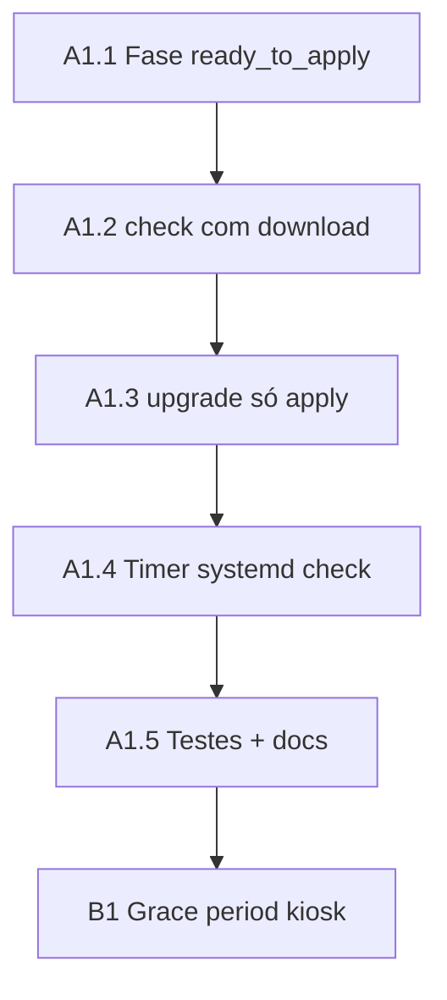

# Plano de execução — check com download e `upgrade` só apply

- **Status:** ativo
- **Data:** 2026-06-25
- **Escopo:** implementar no agente a separação `check` (HTTP + download + verify) vs `upgrade` (apply em cache), fase `ready_to_apply`, timer systemd só `check`, conforme ADR 0002.

**Origem:** sessão grill 2026-06-25; decisões em `docs/adr/0002-ota-check-download-e-grace-period-kiosk.md`.

**Fora de escopo:** overlay grace period no kiosk ([[PLANO_OTA_GRACE_PERIOD_POPUP]] em `jukebox_tv`); servidor OTA produção; auto-update do binário agente.

**Depende de:** ADR 0001 já implementado (writer JSON, `check`, `upgrade` legado).

---

## 1. Decisões de referência (resumo)

| Tópico | Decisão |
|--------|---------|
| `check` | HTTP → se update → download + verify → `ready_to_apply` |
| `upgrade` | Só apply do pacote em cache; sem HTTP nem download |
| Timer systemd | `check` (não `upgrade`) |
| Fases | `checking` → `downloading` → `ready_to_apply` → `applying` → `idle` |
| `update_available` | Obsoleto; não escrever após migração |
| Apply automático pós-grace | Kiosk invoca `upgrade` — não é responsabilidade do timer |

---

## 2. Dependências e ordem sugerida

| Fase | Quem | Bloqueio |
|------|------|----------|
| 1 | Agente (tarefas 1–5) | Nenhum |
| 2 | Kiosk [[PLANO_OTA_GRACE_PERIOD_POPUP]] | Agente A.5 no Pi de dev com `ready_to_apply` estável |

**Regra:** não alterar semântica de `upgrade` no kiosk até o agente publicar comportamento «só apply»; coordenar deploy com plano kiosk.

---

## 3. Tarefas

### 3.1 Modelo e fases JSON

1. Adicionar `ReadyToApply` a `OtaUpdatePhase` (ou equivalente).
2. Marcar `UpdateAvailable` como obsoleto; remover escritas dessa fase.
3. Actualizar validação de fases no writer e testes de serialização.
4. Documentar transição em `docs/API.md` (tabela de fases ADR 0002).

### 3.2 Refactor `check`

1. Após HTTP com update elegível: transitar `checking` → `downloading`.
2. Reutilizar serviço de download e verificação existente (hash, assinatura RSA-PSS).
3. Ao concluir verify: `downloading` → `ready_to_apply`; `update_available=true`; `remote_version` do manifesto.
4. Se pacote em cache já válido para `remote_version`: saltar download, ir directo a `ready_to_apply`.
5. Sem update: `checking` → `idle`; `update_available=false`.
6. Erros: `phase=error`, `error_message` legível.
7. Manter política de intervalo/janela/`ota_check_enabled` e `--force`.

### 3.3 Refactor `upgrade`

1. Remover orquestração `check` + download do comando `upgrade`.
2. Validar existência de pacote em cache compatível com `remote_version` no JSON (ou manifesto em staging).
3. Se cache ausente ou versão divergente: exit ≠ 0, `phase=error`, mensagem para UI A2.
4. Fluxo apply: `ready_to_apply` → `applying` → `idle` (ou `error` + rollback conforme [[PLANO_OTA_EXECUCAO_PI]]).
5. `--force` em `upgrade`: bypass de janela/intervalo para apply manual; **não** implica download.

### 3.4 Systemd e packaging

1. Alterar `packaging/systemd/jukebox_ota_agent.service`: `ExecStart=... **check** ...`.
2. Actualizar `packaging/pi/README.md` e `docs/howto/DEPLOY_PI.md`.
3. Validar que `SuccessExitStatus` e timer continuam correctos para exit 2 do `check` (update disponível).

### 3.5 Testes e documentação

1. Testes unitários: transições de fase, `upgrade` sem cache, `check` idempotente com cache.
2. Teste integração mock `file://`: ciclo completo até `ready_to_apply`; `upgrade` apply.
3. Actualizar `docs/adr/README.md` (ADR 0002).
4. Actualizar `CONTEXT.md` (glossário).
5. Registar pegas em `.cursor/napkin.md`.

---

## 4. Ficheiros-alvo

| Caminho | Alteração |
|---------|-----------|
| `src/Jukebox.Ota.Agent/Domain/` | Enum fases, `OtaUpdateStatus` |
| `src/Jukebox.Ota.Agent/Application/CheckUpdateService.cs` | Download integrado no check |
| `src/Jukebox.Ota.Agent/Application/UpgradeUpdateService.cs` | Só apply; validação cache |
| `src/Jukebox.Ota.Agent/Infrastructure/` | Store JSON, paths de cache/staging |
| `src/Jukebox.Ota.Agent/Interfaces/Cli/AgentCli.cs` | Semântica comandos |
| `packaging/systemd/jukebox_ota_agent.service` | `check` no ExecStart |
| `tests/Jukebox.Ota.Agent.Tests/` | Fases, upgrade sem cache, check+download |
| `docs/API.md` | Fases, `check`, `upgrade` |
| `docs/adr/0002-ota-check-download-e-grace-period-kiosk.md` | ADR aceito |
| `CONTEXT.md` | Glossário `ready_to_apply`, semântica comandos |

---

## 5. Critérios de aceite

- [ ] `check` automático (timer) com update remoto deixa JSON em `ready_to_apply` e pacote validado em cache.
- [ ] `check` sem update deixa `phase=idle`, `update_available=false`.
- [ ] `upgrade` com cache válido executa apply e termina em `idle` sem tráfego HTTP de manifesto.
- [ ] `upgrade` sem cache ou versão incorrecta falha com mensagem clara (suporte a recusa A2 no kiosk).
- [ ] Timer systemd invoca apenas `check`.
- [ ] Fase `update_available` deixa de ser escrita pelo agente.
- [ ] Testes automatizados cobrem transições principais e regressão do writer atómico (ADR 0001).
- [ ] `docs/API.md` e ADR 0002 alinhados com comportamento implementado.

---

## 6. Ver também

- `docs/adr/0002-ota-check-download-e-grace-period-kiosk.md` — ADR aceito
- `docs/adr/0001-ota-update-status-json-e-comando-upgrade.md` — contrato base
- [[PLANO_OTA_GRACE_PERIOD_POPUP]] — overlay e contagem no kiosk
- [[PLANO_OTA_UI_SETTINGS]] — botões manuais e recusa A2
- [[PLANO_OTA_EXECUCAO_PI]] — cache, apply, rollback
